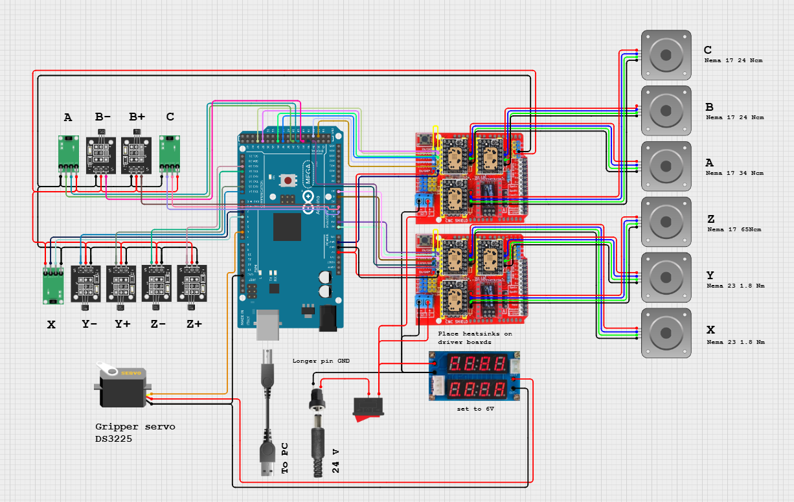

# Arctos Robot Arm
A hardware-focused robotic arm project involving assembly, servo integration, Arduino-based control, and mechanical debugging.

## Overview
This project focused on assembling and testing a multi-servo robotic arm/gripper system for object manipulation. The main work involved integrating servo motors, testing Arduino-based servo control, troubleshooting mechanical alignment issues, and diagnosing motion limitations in the arm.

## My Contributions
- Assembled and tested a multi-servo robotic arm/gripper system
- Integrated servo motors and mechanical components into the arm structure
- Tested individual servos and functional axes using Arduino-based control code
- Troubleshot mechanical alignment, servo movement, and stability issues
- Evaluated servo behavior based on torque, size constraints, and response speed
- Analyzed power requirements and system stability for multi-servo operation
- Diagnosed mechanical resistance in A/B/C-axis gear assemblies through repeated disassembly, reassembly, lubrication, and servo testing

## Technologies
- Arduino
- Servo motors
- Stepper motors
- CNC shields
- Embedded systems
- 3D-printed mechanical components
- Hardware debugging

## Functional Testing Summary
| Component | Status | Notes |
|---|---|---|
| Gripper | Functional | Basic open/close servo control tested |
| X-axis | Functional | Stepper movement verified |
| Y-axis | Functional | Stepper movement verified |
| Z-axis | Functional | Stepper movement verified |
| A/B/C axes | Limited | Gear assemblies had excessive mechanical resistance |

## Current Status
The gripper, X-axis, Y-axis, and Z-axis are functional with basic control. The A/B/C rotational axes are not yet operating reliably due to excessive mechanical resistance in the gear assemblies. Even after repeated disassembly, reassembly, and lubrication attempts, the gears remained too stiff for the 30 kg-cm servos to rotate reliably.

Future improvements would require reducing gear friction, redesigning or replacing the problematic gear assemblies, or using a different actuator/gear mechanism for the rotational axes.

## Wiring
The system used an Arduino Mega with two CNC shields to drive the X/Y/Z/A/B/C stepper axes, along with a separate servo connection for the gripper. The wiring diagram is included as a reference for the test setup.

Note: The diagram documents the test wiring setup used during development and may not represent a finalized production-ready circuit.

## Team Contributions
This project involved team collaboration. My main contributions were hardware assembly, servo integration, Arduino-based testing, and mechanical troubleshooting.
The Python GUI controller was developed by a teammate and used to send serial commands to the Arduino during testing.
The CAD images are included as mechanical references for documentation, while my main contributions focused on assembly, integration, testing, and troubleshooting.

## Notes
This was primarily a hardware integration and debugging project, so the repository focuses on project documentation and selected control/testing code rather than a full software stack.
